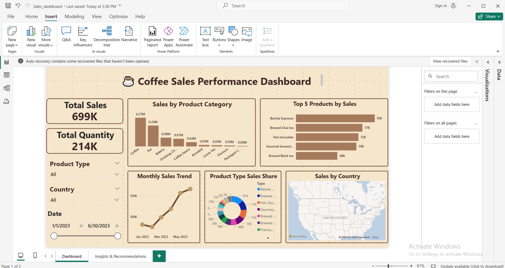

# Coffee Sales Dashboard (Data Analysis Project)

## Project Overview
This project focuses on analyzing **coffee sales performance** using a complete data analytics workflow — from data cleaning to visualization.  
The goal was to identify key trends, measure profitability, and uncover actionable business insights using **SQL**, **Python**, **Power Query**, and **Power BI**.

## Objectives
- Clean and transform raw coffee sales data for analysis.  
- Use SQL and Python to perform data exploration and validation.  
- Identify top-performing products, sizes, and countries.  
- Analyze sales patterns by time, region, and product type.  
- Create an interactive Power BI dashboard that highlights insights and recommendations.

## Tools & Technologies
| Tool / Language | Purpose |
|------------------|----------|
| **SQL** | Data extraction, querying, and aggregation |
| **Python (Pandas, Matplotlib, Seaborn)** | Data analysis, and visualization |
| **Power Query** | Data transformation and integration within Power BI |
| **Power BI** | Dashboard creation, KPIs, and storytelling |

## Dashboard Features
**One-page Power BI Dashboard includes:**
- **Total Sales & Quantity KPIs** — cards showing key metrics.  
- **Sales Over Time** — line chart tracking monthly or seasonal performance.  
- **Top Countries by Sales** — map or bar chart showing best markets.  
- **Top Products** — bar chart of most popular items.  
- **Sales by Product Type** — donut or column chart for product categories.  
- **Filters & Slicers** — for region, product type, and time period.

## Dashboard Preview

## Insights
- **Steady Growth:** Sales and profits have shown consistent growth throughout the year.  
- **Seasonal Peaks:** Highest demand observed during **November–December**.  
- **Top Markets:** **Brazil, USA, and Germany** drive most of the revenue.  
- **Popular Products:** **Ground Coffee** and **Espresso** are the best-sellers.  

## Recommendations
- Increase marketing and stock before **peak seasons**.  
- Focus on **top-performing products and countries** for growth.  
- Revisit **pricing strategies** for low-margin, high-volume items.  
- Offer **bundle deals or loyalty rewards** to encourage repeat purchases.  
- Use **forecasting models** to optimize inventory and reduce waste.

## Author
Created by [Nourhan Adel] — 2025
  

